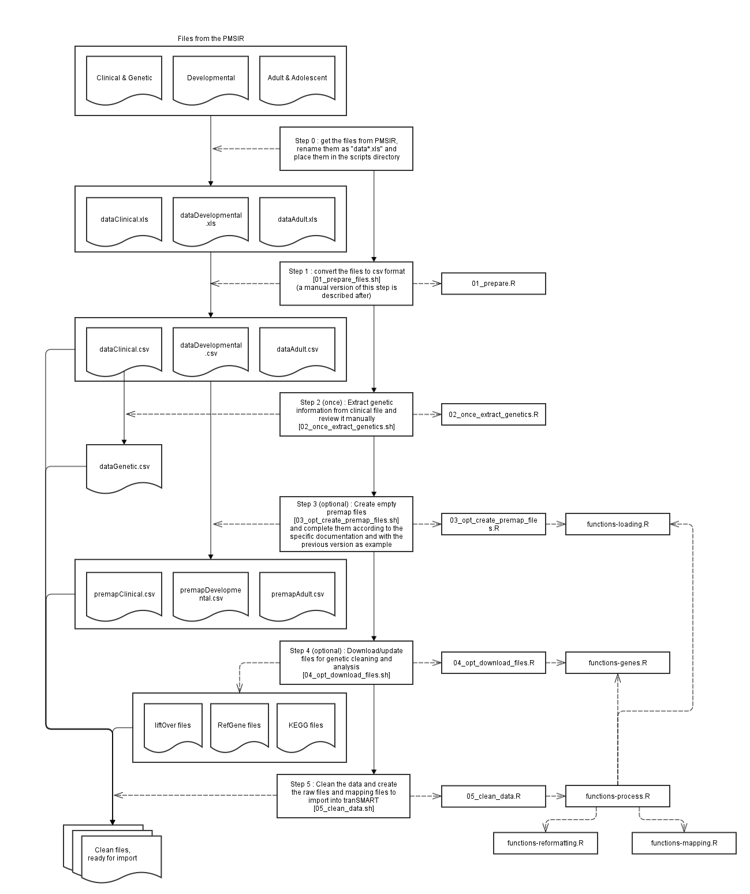
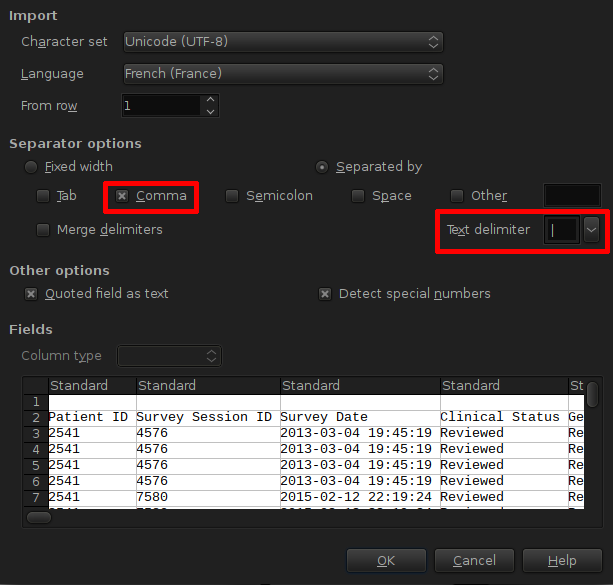

README
======

R scripts to load and clean PMSIR raw data files.

This diagram is an overview of the process. On the left are the data manipulated by each steps. On the right are the R scripts called for each step.  
Each step is detailed after the diagram.



Step 0
------

Get the files from PMSIR.  
Three input files are obtained from the registry:

* Clinical Questionnaire + Genetic test results
* Developmental Questionnaire
* Adolescent and Adults Questionnaire

These three files are HTML tables in .xls files.  
**Do not open these files with excel !**

They must first be renamed as following:
* dataClinical.xls
* dataDevelopmental.xls
* dataAdult.xls

and placed in the scripts folder.

Step 1
------

The files must be converted to the csv format.  
This is done using the first script: *01_prepare_files.sh*  
This script calls the *01_prepare.R* R script.  
Three new files are created:
* dataClinical.csv
* dataDevelopmental.csv
* dataAdult.csv

These files are UTF-8 encoded, comma (,) separated, with pipes (|) as quotes to delimit text fields.  
You can check the csv files by opening them in LibreOffice (excel doesn't accept pipes as text delimiters)



Step 1 - Manual alternative
---------------------------

**In case step 1 fails**, it can still be done manually using the following procedure:  
The files must first be prepended with the following lines so that Excel/LibreOffice registers the correct encoding:
```html
<html>
<head>
<meta http-equiv="Content-Type" content="text/html; charset=utf-8">
</head>
```
Open the files in a text editor, add these 4 lines at the beginning of the file and save it.  
Open the files in Excel/LibreOffice.  
The files contain the entirety of the data two times (headers included) that have to be removed.  
Save the files to the csv format (US type: separator is a comma (,), blocks of text surrounded by pipes (|)) using the following naming convention:  
* dataClinical.csv for the Clinical&Genetic Questionnaire
* dataDevelopmental.csv for the Developmental Questionnaire
* dataAdult.csv for the Adolescent and Adults Questionnaire

Step 2 (run once)
-----------------

The genetic data must be extracted from the dataClinical file.  
To do so, run the second script: *02_once_extract_genetics.sh*  
This script calls the *02_once_extract_genetics.R* R script, and creates the *dataGenetic.csv* file.  
This file must be reviewed manually. This process is detailed in a dedicated section of this readme.

Step 3 (optional)
-----------------

Regenerate the premapping files.  
The *03_opt_create_premap_files.sh* script uses the data files to generate the empty premapping files.  
This script calls the *03_opt_create_premap_files.R* R script, which in turn uses functions from the *functions-loading.R* script.  
The script creates three premapping files, one for each data file:
* premapClinical.csv
* premapDevelopmental.csv
* premapAdult.csv

The premapping files are used to tell how to process each variable and where to put it in the ontology.  
Already filled in premapping files are on the repo and will work as long as the structure of the registry doesn't change.  
In case there are modifications to make to the processing, these premapping files can be amended.  
In case the registry changes (new variables, renamed variables, etc.), the premapping files can be generated again from scratch.
They then have to be completed again, mainly using the previous ones as a template.  
A more in-depth manual on how to use the premapping files and add processing code to the scripts can be found in a dedicated section of this readme.

Step 4 (optional)
-----------------

Download or update the files and tools used to process the genetic data.
The *04_opt_download_files.sh* script calls the *04_opt_download_files.R* R script which in turn uses a function from the *functions-genes.R* script.  
This downloads the following files:
* liftOver
	+ the liftOver tool itself
	+ the hg17ToHg19.over.chain.gz mapping file from Human Genome Assembly Hg17 to Hg19
	+ the hg18ToHg38.over.chain.gz mapping file from Human Genome Assembly Hg18 to Hg38
	+ the hg19ToHg38.over.chain.gz mapping file from Human Genome Assembly Hg19 to Hg38
* RefGene
	+ refGene.txt.hg17 gene references for Human Genome Assembly Hg17
	+ refGene.txt.hg18 gene references for Human Genome Assembly Hg18
	+ refGene.txt.hg19 gene references for Human Genome Assembly Hg19
	+ refGene.txt.hg38 gene references for Human Genome Assembly Hg38
* KEGG
	+ the KEGG_genes.txt KEGG Genes list
	+ the KEGG_pathways.txt KEGG Pathways list
	+ the KEGG_link_genes_pathways.txt KEGG relations between genes and pathways

The liftOver tool is used to convert chromosome coordinates to the latest Human Genome Assembly (GRCh38/hg38):  
* hg17 -> hg19 -> hg38
* hg18 -> hg38
Some coordinates still cannot be converted, so the result is a mix of different human genome assemblies, with the fewest not up to date as possible.

The RefGene files are used to extract the name of the genes affected by the deletions.  
Because some coordinates cannot be converted to the latest genome assembly, the refGene files for all assemblies are downloaded.

The KEGG files are used to extract the pathway annotations for each gene.

Step 5
------

Use the prepared files, the premapping files and the external tools to clean the data and enrich the genetic test results.  
The *05_clean_data.sh* scripts calls the *05_clean_data.R* R script, which in turn uses functions from:
* *functions-loading.R* to load the data and premapping files
* *functions-process.R* to process each level of depth of the data
* *functions-mapping.R* to generate the Kettle mapping file
* *functions-reformatting.R* to reformat and clean variables according to the rules in the premapping files
* *functions-genes.R* to enrich the genetic information

This final script creates the *output/* directory containing the cleaned data files (one for each section of each questionnaire) and the Kettle mapping file.


Premapping files
================


